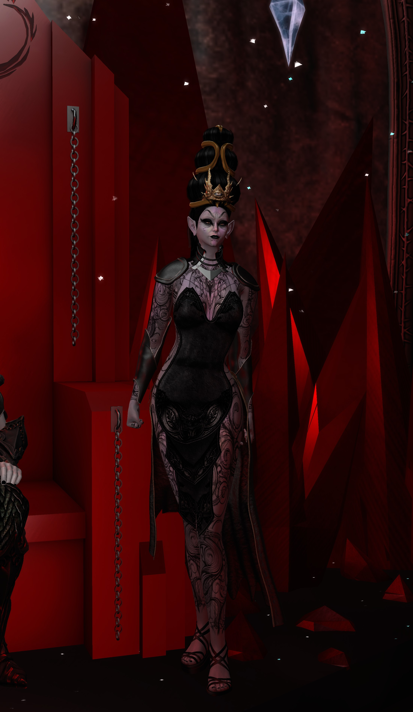

*Artwork: [“Stormbringer, Cymoril” by dameklaudia on DeviantArt](https://www.deviantart.com/dameklaudia/art/Stormbringer-Cymoril-845719504). Image used on this page with credit and a link to the original source.*



The warm welcome of the grave faces,
As if they are alive, as if they are dead.
No! this realm of the drags, not on heavens,
Not on earth, for the hearts are sad,
And cracked, cracked in two, cracked more,
They shouldered the burden of a heavy lore.

Darkness crept upon the fertile field; silence dominated the domain.
Even Selene hesitated to give her glow over the marble, erect stones,
With one woefully reads, "inside is absent of light; dark and insane!
Not darker than out, with the cracker gone, called wise and Schatz."

She was the sky athwart the ocean, her soul was brave,
She was freer than the oceans, her soul flew as a dove,
Across the oceans, she was a fair Columbus with sins of Seven,
O, my lovely spirit, how you have fallen from Heaven,
How you have struck the earth, my lovely spirit.

As she flew over the field in darkness, I cried from within,
"Caelum non animum mutant qui trans mare currunt"
Her wings flapped; my grief grew suppressed
I would shake the earth, if she reendowed.
Oh, my lovely spirit, how you have fallen from heaven,
You were far from the alleged sins of seven.

The folk of the grave faces, nor dead, neither alive,
Looked upon thy glory as you, by nature, flew,
I cried from within, "Beware thy glory, my lovely spirit"
None of the folk seemed to take a notice of this lit
Mourning. THE fair Carmilla, nymph, in thy orisons,
Be all my sins remember'd.

In the graveyard, morning shone all over again,
The grave faces were lost into the cracks of soil,
Life grew anew, you grew anew, you were life.
Under the soil, I saw no light nor life, oh my disdain,
I was nor dead, neither alive, you had killed me,
You had given me a life, oh, my lovely spirit.

It was cold as death, hot as love, warm as you,
It was so to those who feel, under the soil,
He felt nothing, he felt everything
For she was the Universe.
